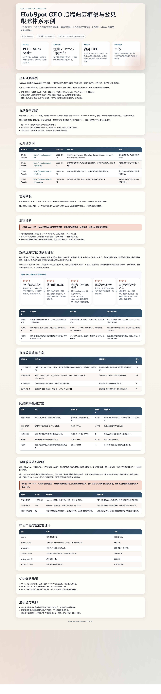
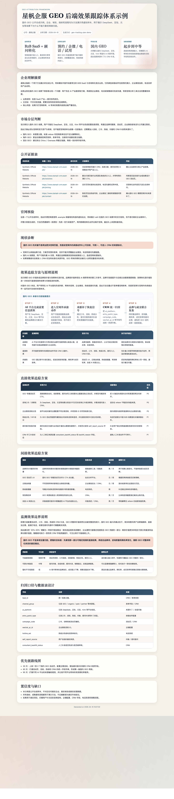

# geo-tracking-plan

`geo-tracking-plan` is a public GEO skill for generating a company-specific backend tracking and attribution plan from a company name plus optional supporting context. It is designed for open-source use: official-site-first, evidence-traceable, market-aware, and safe to reuse without private systems.

## 中文概述

`geo-tracking-plan` 用来做一件事：输入公司名称和少量辅助信息，先以官网和其他官方资产为核心完成权威检索，再识别业务特征、市场范围与转化链路，最后输出一套适合这家公司的 GEO 后端效果追踪方案。

它不是内容策略 skill，也不是 CRM / BI 实施 skill。它的定位是：

- 生成个性化 GEO 追踪方案
- 明确直接效果与间接效果的监测方法
- 区分国内 GEO、海外 GEO 和混合 GEO 的方法侧重点
- 产出可直接交付的 HTML / Word 报告

## English Overview

`geo-tracking-plan` owns one clear job: start from a company name, retrieve authoritative public evidence anchored on the official site, identify business and market characteristics, and produce a company-specific GEO backend tracking plan.

It is not a content strategy skill and not a CRM or BI implementation skill. It is built to:

- generate a personalized GEO measurement plan
- separate direct and indirect tracking logic
- distinguish China, overseas, and hybrid GEO environments
- produce directly shareable HTML and Word deliverables

## 特点 / Features

### 中文

- 官网优先：先核验官网，再使用其他公开资料补强判断。
- 公司特征识别：判断业务类型、转化动作、承接资产、站点能力。
- 市场分层：显式区分国内 GEO、海外 GEO 和混合 GEO。
- 双层监测：同时输出直接效果与间接效果。
- 方法可解释：补充品牌价值、直接效果、间接效果之间的原理说明，而不是只给动作清单。
- 边界清晰：显式说明可直接观测、可部分恢复和暂时不可观测的贡献边界。
- 可交付：支持生成 HTML 和 DOCX 版本的方案。
- 开源安全：不依赖飞书、私有 CLI、内网系统或未授权资料。

### English

- Official-site first: verifies the official site before using secondary public material.
- Business-aware: identifies business type, conversion path, site capability, and existing assets.
- Market-aware: distinguishes China, overseas, and hybrid GEO conditions.
- Dual-layer tracking: covers both direct and indirect measurement.
- Deliverable-ready: renders HTML and DOCX plan outputs.
- Open-source safe: no Feishu, private CLI, intranet systems, or unsanitized data.

## 优势 / Advantages

### 中文

- 容易解释：输出是业务方看得懂的方案，不是抽象方法论。
- 容易复用：同一个 skill 可以服务 B2B、SaaS、电商、预约咨询等多种业务。
- 容易开源：方法依赖公开资料与官方站点，不绑定内部环境。
- 容易落地：方案会直接映射到落地页、表单字段、口令、电话、问卷、CRM 字段等具体动作。

### English

- Easy to explain: produces an operator-friendly plan, not vague GEO theory.
- Easy to reuse: works across B2B, SaaS, ecommerce, and consultation-driven businesses.
- Easy to open-source: depends on public evidence rather than private systems.
- Easy to operationalize: maps to concrete tracking actions such as landing pages, hidden form fields, promo codes, phone lines, surveys, and CRM fields.

## 核心逻辑 / Core Logic

### 中文

1. 统一企业实体与官网。
2. 以官网和官方资产为锚点建立证据表。
3. 判断业务类型与核心转化动作。
4. 判断是国内 GEO、海外 GEO，还是混合 GEO。
5. 输出直接效果追踪方案。
6. 输出间接效果追踪方案。
7. 设计指标口径、数据字段和路线图。
8. 如需要，渲染成 HTML / DOCX。

### English

1. Normalize the company entity and official website.
2. Build an evidence table anchored on official assets.
3. Identify business type and primary conversion actions.
4. Decide whether the scenario is China, overseas, or hybrid GEO.
5. Design direct tracking methods.
6. Design indirect tracking methods.
7. Explain the tracking principles, value layers, and observability boundaries.
8. Define metrics, data fields, and rollout roadmap.
9. Render HTML and DOCX if requested.

## 国内与海外 GEO 的差异 / China vs Overseas GEO

### 中文

- 海外 GEO 更适合围绕官网页矩阵、表单来源字段、页面事件、注册与升级链路来设计归因。
- 国内 GEO 通常不能只靠官网，需要更多“来源补丁”，例如口令、活动页、企微、电话、问卷和人工补录。
- 混合 GEO 不建议一套口径通吃，应该拆成两套主链路后再统一收口。

### English

- Overseas GEO can rely more on official site structure, form-source fields, page events, registration, and upgrade funnels.
- China GEO usually needs extra recovery mechanisms such as promo codes, dedicated campaign pages, WeChat or phone entry points, surveys, and manual source backfill.
- Hybrid GEO should not force one measurement model across all markets. Split the main attribution paths first, then reconcile them into a shared dictionary.

## 双公开示例 / Two Public Demos

### 海外路径 / Overseas Path

```markdown
- company_name: HubSpot
- official_site: https://www.hubspot.com/
- market_scope: overseas
- category: SaaS
- typical_conversion_actions: free signup, demo booking, paid upgrade
- priority_ai_platforms: ChatGPT, Gemini
- deliverable_format.html: true
- deliverable_format.docx: true
```

Artifacts:

- Input brief: [report_input.json](../../skills/geo-tracking-plan/examples/hubspot-demo/report_input.json)
- HTML report: [hubspot-geo-tracking-plan.html](../../skills/geo-tracking-plan/examples/hubspot-demo/hubspot-geo-tracking-plan.html)
- DOCX report: [hubspot-geo-tracking-plan.docx](../../skills/geo-tracking-plan/examples/hubspot-demo/hubspot-geo-tracking-plan.docx)

### 国内路径 / China Path

```markdown
- company_name: 星帆企服
- official_site: https://www.starsail-crm.example/
- market_scope: china
- category: B2B SaaS + consultant-led conversion
- typical_conversion_actions: 咨询预约, 企业微信加粉, 电话回呼, 产品试用
- priority_ai_platforms: DeepSeek, 豆包, 元宝, Kimi
- deliverable_format.html: true
- deliverable_format.docx: true
```

Artifacts:

- Input brief: [report_input.json](../../skills/geo-tracking-plan/examples/xingfan-demo/report_input.json)
- HTML report: [xingfan-cn-geo-tracking-plan.html](../../skills/geo-tracking-plan/examples/xingfan-demo/xingfan-cn-geo-tracking-plan.html)
- DOCX report: [xingfan-cn-geo-tracking-plan.docx](../../skills/geo-tracking-plan/examples/xingfan-demo/xingfan-cn-geo-tracking-plan.docx)

### 对比重点 / What The Two Demos Show

| 维度 | Overseas demo | China synthetic demo |
|---|---|---|
| 主承接资产 | 官网页矩阵、产品页、定价页、表单 | 官网 + 活动页 + 企微 + 电话 + 顾问入口 |
| 直接效果重点 | 注册、演示预约、升级 | 口令、活码、热线、预约页、人工补录 |
| 间接效果重点 | UV、注册率、激活率、升级率 | 问卷来源、企微加粉、电话接通、有效商机率 |
| 数据模型特点 | 表单字段与产品分析优先 | 来源补丁字段与 CRM 补录优先 |
| 演示性质 | 公开公司 + 合成方法样本 | 完全公开的合成公司样本 |

## 案例截图 / Case Screenshots

HubSpot HTML demo preview:



China synthetic HTML demo preview:



## Package Links

- Skill package: [skills/geo-tracking-plan](../../skills/geo-tracking-plan)

## 适用边界 / Scope Boundaries

### 中文

适合：

- GEO 后端效果监测方案
- GEO attribution / tracking design
- 官网为核心的 GEO 追踪体系
- 需要中英文都能理解的公开交付逻辑

不适合：

- GEO 内容选题和写作
- SEO / SEM 纯投放分析
- CRM / BI 代码实施
- 只有泛方法论，没有公司对象的请求

### English

Best for:

- GEO backend tracking plans
- GEO attribution and measurement design
- official-site-centered GEO monitoring systems
- public reusable deliverable logic

Not for:

- GEO content ideation or writing
- pure SEO or SEM analysis
- CRM or BI implementation code
- generic GEO education without a company-specific target

## Repository Notes

- Package path: `skills/geo-tracking-plan`
- Registry entry: `registry/skills.json`
- Required deliverable renderer: `skills/geo-tracking-plan/scripts/render_geo_tracking_plan.py`
